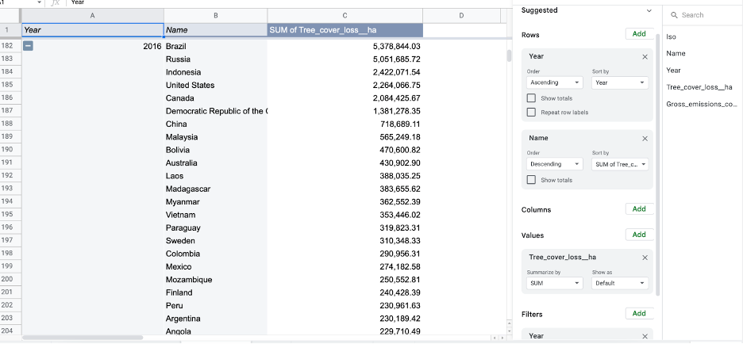
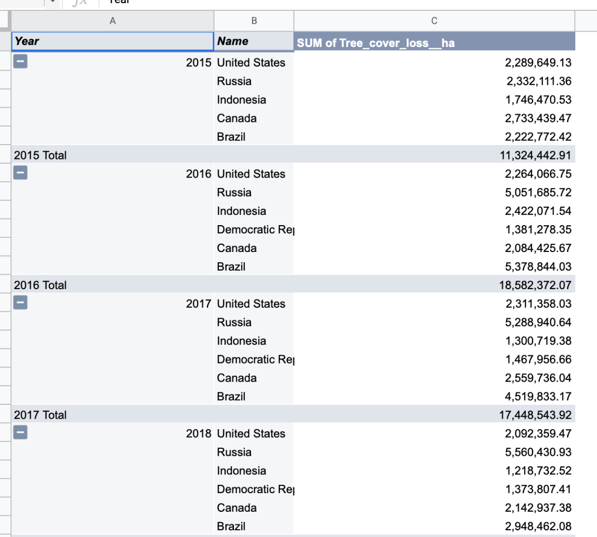

# J124 Final Project: Data Analysis of Tree Cover Loss
## By Heather Fergus
*This dataset was downloaded as a .csv file from Global Forest Watch*
## Data Analysis
### *Notes*
* The dataset notes there was a change in research model around 2011, which impacts comparing data from before 2015 with after 2015. Therefore, the data in this analysis will be filtered to only look at the years 2015 to 2021. 
* This dataset looks at total tree cover loss globally, but this doesn't just include deforestation. This could also be due to conservation efforts, wildfires, human and non-human causes of forest loss. 

#### Question 1: Which year had the highest total tree loss in hectares? Which had the lowest?
1. First I highlighted the data and created a new pivot table in the spreadsheet. 
2. Then I put “Tree_cover_loss_ha” in the values section, with “Year” in rows and filters, to filter for only 2015 to 2021. 
3. I sorted “Tree_cover_loss_ha” to summarize as SUM, as this will determine the total tree loss in that year. Also I sorted the “Year” to be descending by the “Tree_cover_loss_ha” as this will clearly display the highest amount first.

**_Answer: 2016 saw the highest total amount in tree cover loss globally at about 29,674,794 hectares, while 2015 saw the lowest amount globally at about 19,622,330 hectares._**

#### Question 2: (a) Which top five regions in 2016 and 2015 had the highest amount of tree cover loss? (b) How does this compare to the five countries with the highest tree loss each year from 2015-2021? 
#### (a)
1. First using the pivot table I filtered the “Years” column to only contain 2015 and 2016. 
2. I added the “Name” column to the Rows section and sorted this column as descending by the sum of “Tree_cover_loss_ha”. 

**_Answer: In 2015 Canada appeared to have the highest hectares of tree cover lost, with over 2.7 million hectares, with Russia, the United States, Brazil, and Indonesia following. In 2016, Brazil became the highest region in tree cover loss at 5.3 million hectares, with Russia following close behind at just over 5 million hectares. This is a sharp increase of just under 3 million hectares in one year. Following these countries is Indonesia, the United States, and Canada._**

#### (b) 
1. To determine the top five regions of tree cover loss in each year I filtered the “Years” column in the pivot table once again to include years 2015 to 2021, and kept the other columns in the pivot table sections. 
2. Then I went through each year, determining the five countries with the most tree loss. 
3. For simplicity in the chart screenshot, since the top five regions each year all had above 1 million hectares in total loss, I filtered the tree cover loss to above 1 million hectares. 

**_Answer: Notably, the data shows that every year the United States, Russia and Brazil were always among the top five countries with the highest tree cover loss. Both 2015 and 2016 had the same five countries with the highest tree loss, and were the only two years in which Indonesia was listed as the top five. The United States has dropped below its tree loss levels in 2015 each year except for 2017, yet Russia and Brazil have consistently held higher levels than 2015 in each subsequent year._**

#### Question 3: What was the median amount of tree cover lost in Russia, the United States and Brazil? Using the median will account for the sharp increase from 2015 to 2016 in Brazil and Russia, and any remaining outliers. 
1. First, in the spreadsheet of data I used a filter to select only the United States to be listed. 
2. I created a new column labeled “Median” in the spreadsheet and entered the equation =MEDIAN() and highlighted all the data in the “Tree_cover_loss_ha” column for the range. 
3. I followed these steps for both Brazil and Russia. 

**_Answer: United States is 2,109,918.28 hectares, Brazil is 2,991,909.31 hectares, and Russia is the highest median with 5,288,940.64 hectares._**

#### Question 4: (a) What was the percent change in total tree cover lost for the United States, Brazil, and Russia, by each year? (b) What is the percent change from 2015 to 2021? 
#### (a) 
1. First in the previous pivot table I cleared the columns.
2. I added “Year” to the rows section and filter section, and set the filter to show only 2015 to 2021. 
3. I added “Tree_cover_loss_ha” to the values section. I added “Name” to the rows section and filter sections, choosing to only show the United States, Russia, and Brazil. 
4. Then I created a new column in the same spreadsheet named “Percent Change” and wrote the equation =((current year value - previous year value)/ previous year value), for example in the table for the percent change from 2020 to 2021, using the total tree loss values, I wrote ((2021 value - 2020 value)/2020 value). 
5. I set the values to the “%” symbol and rounded the percentages to full values with the “<- .0” symbol.

**_Answer: In 2016, the total tree cover lost in the United States decreased by 1%, while it increased in Russia by 117% percent and in Brazil 142%. Additionally after decreasing the previous year by 7%, tree cover loss in the United States increased by 4% in 2021._**

#### (b) 
1. For overall percentage change from 2015 to 2021, I switched the “Year” to the columns section and filtered it to only include 2015 and 2021. 
2. I created another column again named “Percent Change” and used the equation =((2021 value - 2015 value)/ 2015 value), for all three countries. 

#### Question 5: The Democratic Republic of Congo, was in the top five regions for four out of the seven years, what was the percent change in tree loss by each year? Between 2015 and 2021? 
1. Using the previous pivot table, I shifted the “Year” back to the rows section. 
2. I filtered the “Name” to only include The Democratic Republic of Congo.
3. I created two new columns “Percent Change - yearly” and “Percent Change 2015-2021” and used the equation =((current year value - previous year value)/ previous year value) for analyses for (a) and (b). 

**_Answer: Most notably there was a large increase in tree loss in 2016 compared to 2015, with the following years having percentage increase and decrease of smaller values. From 2015 to 2021 there was an overall increase by 34%._**

#### Question 6: Per 1000 hectares of total global trees lost over 2015 to 2021, what is the rate of tree cover loss for Russia, Brazil and the United States?  
1. I set up the pivot table with “Name” and “Year” in rows and “Tree_cover_loss_ha” in values. 
2. After ordering “Names” as descending by total tree cover lost, I added a new column titled “Rate of Tree Cover Lost.”
3. In the cells next to the totals for the countries I wrote =((Tree loss total / global total) * 1000). For example for Russia it was =(C2/$C$203) * 1000.

**_Answer: Over 2015 to 2021, Russia had a rate of 189.62 hectares lost per 1000 hectares, Brazil had 134.60 hectares lost per 1000 hectares, and the United States had 84.39 hectares lost per 1000 hectares._**

#### Question 7: Over 2015 to 2021, what was the total global emissions for the United States, Russia, and Brazil? What percentage of global emissions did each country produce over 2015 to 2021? 
1. I first added the SUM of “Gross_emissions_co2e_all_gases__Mg” to the values section. This presented the total global emissions for all three countries. 
2. I then changed the  “Gross_emissions_co2e_all_gases__Mg” to be shown as “% of grand total” 

**_Answer: Over the tree cover lost from 2015 to 2021, Brazil emitted nearly 15 billion tons of greenhouse gases (Mg is a measurement of Megagrams, equivalent to a ton in gas) which accounted for 19.49% of the global emissions from tree loss, the United States emitted nearly 7 billion tons accounting for 8.90% of the global total, and Russia emitted just over 6 billion tons accounting for 8.07% of the global total._**

## Story Summary 
Since this analysis covers total tree cover loss, it accounts for all activities that result in tree loss. This could be conservation efforts, deforestation, human or not human caused. It is interesting how in the data, the United States is consistently in the top regions with the most loss in total tree cover, along with Brazil which is home to the Amazon rainforest, and Russia. In regards to percent change over each year, tree loss in the United States has stayed pretty consistent, yet it is losing about 2 million hectares of tree cover each year. For this story pitch, I would like to look deeper at what is the main cause of tree loss in the United States, if it is caused mainly by deforestation for agriculture for example. I would also like to compare this with the causes of tree loss in Russia, Brazil, and The Democratic Republic of Congo, all of which showed sharp increases in tree loss from 2015 to 2016 at 117%, 142%, and 49% respectively. These countries also showed high rates of tree cover loss per 1000 hectares lost in the years from 2015 to 2021. 

A source that could help me in developing this story is another piece of data from [Global Forest Watch](https://www.globalforestwatch.org/dashboards/global/?category=summary&location=WyJnbG9iYWwiXQ%3D%3D&map=eyJkYXRhc2V0cyI6W3sib3BhY2l0eSI6MC43LCJ2aXNpYmlsaXR5Ijp0cnVlLCJkYXRhc2V0IjoicHJpbWFyeS1mb3Jlc3RzIiwibGF5ZXJzIjpbInByaW1hcnktZm9yZXN0cy0yMDAxIl19LHsiZGF0YXNldCI6InBvbGl0aWNhbC1ib3VuZGFyaWVzIiwibGF5ZXJzIjpbImRpc3B1dGVkLXBvbGl0aWNhbC1ib3VuZGFyaWVzIiwicG9saXRpY2FsLWJvdW5kYXJpZXMiXSwiYm91bmRhcnkiOnRydWUsIm9wYWNpdHkiOjEsInZpc2liaWxpdHkiOnRydWV9LHsiZGF0YXNldCI6InRyZWUtY292ZXItbG9zcyIsImxheWVycyI6WyJ0cmVlLWNvdmVyLWxvc3MiXSwib3BhY2l0eSI6MSwidmlzaWJpbGl0eSI6dHJ1ZSwidGltZWxpbmVQYXJhbXMiOnsic3RhcnREYXRlIjoiMjAwMi0wMS0wMSIsImVuZERhdGUiOiIyMDIxLTEyLTMxIiwidHJpbUVuZERhdGUiOiIyMDIxLTEyLTMxIn0sInBhcmFtcyI6eyJ0aHJlc2hvbGQiOjMwLCJ2aXNpYmlsaXR5Ijp0cnVlfX1dfQ%3D%3D&showMap=true) which documents the Global annual tree cover loss by Dominant drivers. This will help me determine in each year, what was documented as the main driver behind global tree loss, which I can compare with my current data analysis. I can also filter the data to specify the regions in which the dominant driver was determined, which will help me compare the causes of tree loss between the specific countries I am looking at. Another source that could help me is a study conducted in 2021 named [“Climate impacts of U.S. forest loss span net warming to net cooling.”](https://www.science.org/doi/10.1126/sciadv.aax8859) 
 This research study will help me in my story as it will provide additional context to the relation of forest loss in the United States and what further implications it could have. By determining what is causing the forest loss in the United States and comparing that to Russia, Brazil, and The Democratic Republic of Congo, it is important to establish in the story the significance of the United States being one of the top countries in tree loss. The research study will help me understand these consequences, the importance of tree cover in the environment, and how this loss will impact the mitigation of and adaptation to climate change within the United States. 

### Interviews

1. Juliette Biao Koudenoukpo: *Director of the UN Forum on Forests Secretariat*
  * Telephone: +1 212-963-3401 ; Fax: +1 917-367-3186 ; Email: unff@un.org
  * Koudenoukpo will have knowledge about deforestation and causes of global forest loss, and has also worked as the UN Environment Programme Director. She could describe the relationship between society and the environment, particularly forests, and provide context on  the societal causes behind forest loss globally and ways in which to prevent this. 

2. Frank Lands: *Regional Director at National Park Service* 
  * Telephone: +1 415-623-2100 ; Address: 333 Bush Street, Suite 500 San Francisco, CA 94104-2828
  * Lands will have knowledge on forestry and conservation within the United States and could provide context on large causes of forest loss in the U.S. Lands is regional director of multiple states, including California, and considering the recent wildfires in Yosemite this could provide the story with a perspective on recent forest loss in the US.

## Data Visualization 

**_This is a [bar chart](https://www.datawrapper.de/_/WLn2f/) detailing the top five regions with the highest number of hectares in forest loss, each year from 2015 to 2021._**

